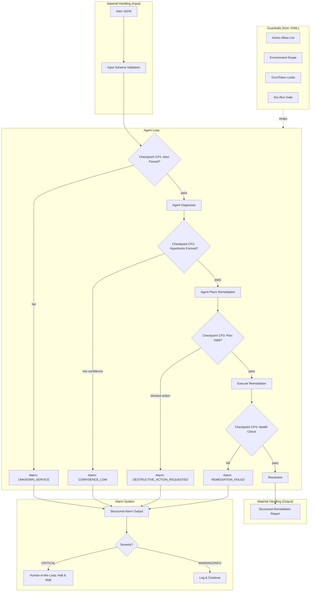
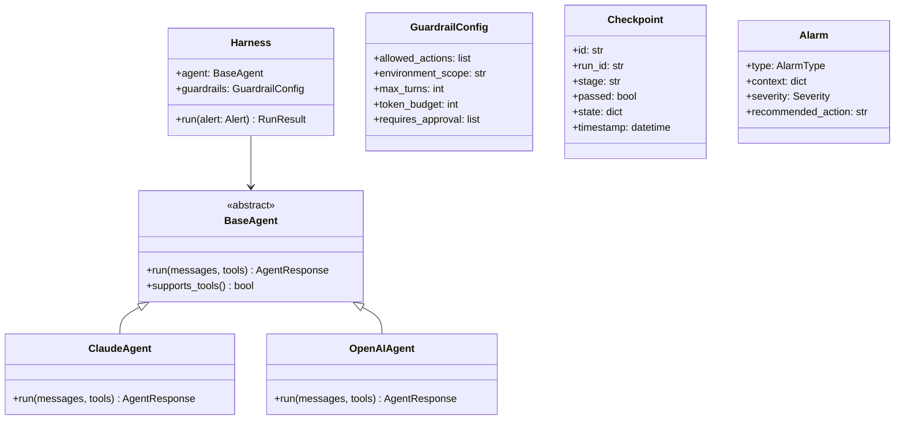

# feat: Ops Runbook Harness

## Summary

Build an AI agent harness that diagnoses and remediates infrastructure incidents using pre-approved runbooks. The harness enforces four architecturally separate pillars — guardrails, checkpoints, material handling, and alarms — each as a distinct module. The agent cannot execute any action not on the approved allow-list. Deployed on Railway with a FastAPI API surface.

---

## Problem Frame

On-call engineers get paged for incidents with known fixes — restarting services, killing hung queries, flushing DNS. The hard part is not running the fix but knowing whether automation can safely act, verifying it worked, and catching downstream damage. This harness makes that safe by starting constrained with pre-approved runbooks and blocking all unapproved mutations.

This is a 24-hour build challenge submission. The harness architecture and pillar separation are the evaluation criteria, not the domain specifics.

---

## Requirements

**Core architecture**

- R1. Four pillars — guardrails, checkpoints, material handling, alarms — exist as distinct, identifiable modules in the codebase, demonstrably separate from the worker agent.
- R2. The agent's behavior changes meaningfully based on guardrail or checkpoint feedback (e.g., blocked action, forced escalation, retry with different approach).
- R3. Guardrails are declared in a YAML config file, not embedded in prompt engineering.
- R4. Checkpoints have explicit pass/fail criteria and are persisted to SQLite with run ID tracking.
- R5. Alarms produce structured output: named alarm type, context, severity, and recommended action.

**Safety & verification**

- R6. The harness blocks any mutation not on the approved allow-list — no exceptions. Non-approved actions raise a `DESTRUCTIVE_ACTION_REQUESTED` alarm and halt the loop.
- R7. Post-action health checks verify the fix worked and detect downstream regression.
- R8. Every incident is documented end-to-end: initial alert, diagnosis, actions taken, outcomes, and downstream effects.

**Agent interface**

- R9. Swappable agent interface via `BaseAgent` abstract class. Dropping in a different LLM provider requires zero harness changes.
- R10. Human-in-the-loop escalation: CRITICAL alarms halt the loop and wait for human decision via API endpoint.

**Checkpoint persistence**

- R11. Checkpoint state persisted to SQLite, one row per checkpoint per run.
- R12. Replay from any checkpoint forward without re-running prior stages (`--replay-from=CP2`).

**Deployment & demo**

- R13. Deployed to Railway with a publicly accessible URL.
- R14. Runs on a real input (alert/incident) at demo time.
- R15. `HARNESS.md` documents the architecture and design.

---

## Key Technical Decisions

- **Four pillars as Python modules, not classes:** Each pillar is a separate module (`guardrails.py`, `checkpoints.py`, `material.py`, `alarms.py`) under a `harness/` package. This makes pillar separation visible in the file tree — judges can see it immediately.
- **YAML-declared guardrails:** Guardrails config lives in `guardrails.yaml` at project root. The harness loads and enforces it; the agent never reads it directly. This satisfies R3 and makes the separation demonstrable.
- **SQLite for checkpoint persistence:** Single-file database, no infrastructure dependency, persists on Railway's volume. Schema: `runs` table + `checkpoints` table with foreign key.
- **Pydantic for all structured types:** Alarms, checkpoint results, material schemas, and tool call contracts are all Pydantic models. Gives type safety and automatic serialization.
- **Mock tool implementations with real interfaces:** Tools (`check_status`, `restart_service`, `read_logs`, `kill_query`, `flush_dns`) have the real interface but return simulated results. A real implementation is a drop-in replacement — same function signature, same return type.
- **Railway for deployment:** Fast deploys (~30s), persistent filesystem for SQLite, no cold-start risk at demo time.
- **Claude as primary agent, OpenAI as swap demo:** `ClaudeAgent` is the primary implementation. `OpenAIAgent` is ~30 lines for the bonus swap demo. Both implement `BaseAgent`.

---

## High-Level Technical Design





---

## Output Structure

```
ops-runbook-harness/
├── guardrails.yaml              # Declared guardrail config
├── harness/
│   ├── __init__.py
│   ├── loop.py                  # Core agent loop with turn limits
│   ├── guardrails.py            # Guardrail loading and enforcement
│   ├── checkpoints.py           # Checkpoint evaluation and persistence
│   ├── material.py              # Input/output schema validation
│   ├── alarms.py                # Alarm types and emission
│   └── models.py                # Shared Pydantic models
├── agents/
│   ├── __init__.py
│   ├── base.py                  # BaseAgent abstract class
│   ├── claude_agent.py          # Claude implementation
│   └── openai_agent.py          # OpenAI swap implementation
├── tools/
│   ├── __init__.py
│   ├── registry.py              # Tool registration and allow-list check
│   ├── check_status.py
│   ├── restart_service.py
│   ├── read_logs.py
│   ├── kill_query.py
│   └── flush_dns.py
├── db/
│   ├── __init__.py
│   └── store.py                 # SQLite checkpoint store
├── api/
│   ├── __init__.py
│   └── routes.py                # FastAPI endpoints
├── main.py                      # Entry point
├── requirements.txt
├── Dockerfile
├── HARNESS.md
└── README.md
```

---

## Scope Boundaries

### In scope
- All four pillars as separate modules with demonstrable separation
- Five mock tools with real interfaces
- Checkpoint persistence and replay
- Human-in-the-loop via API
- Agent swap (Claude + OpenAI)
- Railway deployment
- `HARNESS.md` documentation
- Demo with a real alert input

### Deferred to Follow-Up Work
- Real AWS/infrastructure tool implementations (mock interfaces support drop-in replacement)
- Learning loop / runbook growth (STRATEGY.md track, not required for challenge)
- Observability dashboards (traces and audit logs are in scope; UI is not)
- Multi-tenant support
- Authentication on the API

---

## Implementation Units

### U1. Project skeleton and shared models

**Goal:** Set up the Python project structure, dependencies, and all Pydantic models that the pillars share.

**Requirements:** R1 (pillar separation visible in file tree)

**Dependencies:** None

**Files:** `requirements.txt`, `main.py`, `harness/__init__.py`, `harness/models.py`, `agents/__init__.py`, `agents/base.py`, `tools/__init__.py`, `db/__init__.py`, `api/__init__.py`

**Approach:** Define all shared types in `models.py`: `Alert`, `AlarmType` (enum), `Severity` (enum), `Alarm`, `CheckpointResult`, `RunResult`, `AgentResponse`, `ToolCall`, `ToolResult`. Define `BaseAgent` as an abstract class with `run()` and `supports_tools()`. Set up `requirements.txt` with `fastapi`, `uvicorn`, `anthropic`, `openai`, `pydantic`, `pyyaml`.

**Patterns to follow:** Standard Python package layout with `__init__.py` files. Pydantic v2 model syntax.

**Test scenarios:**
- Import all models from `harness.models` without error
- `BaseAgent` cannot be instantiated directly (abstract)
- Each Pydantic model validates correct input and rejects malformed input
- `AlarmType` and `Severity` enums contain the expected values

**Verification:** `python -c "from harness.models import *; from agents.base import BaseAgent"` succeeds.

---

### U2. Guardrails module and YAML config

**Goal:** Implement declared guardrails loaded from YAML, enforced by the harness.

**Requirements:** R3 (declared, not implicit), R6 (block unapproved mutations)

**Dependencies:** U1

**Files:** `guardrails.yaml`, `harness/guardrails.py`, `tests/test_guardrails.py`

**Approach:** `guardrails.yaml` declares: `allowed_actions` (list of tool names), `environment_scope` (default: `staging`, `production` requires approval), `max_turns`, `token_budget`, `timeout_seconds`, `requires_approval` (list of actions needing human sign-off). `GuardrailEngine` class loads the YAML, exposes `check_action(action_name, environment) -> Allowed | Blocked | NeedsApproval` and `check_limits(turn_count, token_count) -> bool`.

**Patterns to follow:** YAML loaded once at harness init, not per-call.

**Test scenarios:**
- Action on the allow-list in staging passes
- Action NOT on the allow-list is blocked and returns the block reason
- Action requiring approval in production returns `NeedsApproval`
- Turn limit exceeded returns limit violation
- Token budget exceeded returns limit violation
- Malformed YAML raises a clear error at load time
- Empty allow-list blocks all actions

**Verification:** Unit tests pass. A tool call with `delete_database` is blocked.

---

### U3. Alarms module

**Goal:** Implement structured alarm emission with typed alarm models.

**Requirements:** R5 (structured output with type, context, severity, recommended action)

**Dependencies:** U1

**Files:** `harness/alarms.py`, `tests/test_alarms.py`

**Approach:** `AlarmManager` collects alarms per run. `emit(alarm: Alarm)` stores it and returns whether the loop should halt (CRITICAL severity halts). Named alarm types: `UNKNOWN_SERVICE`, `DESTRUCTIVE_ACTION_REQUESTED`, `REMEDIATION_FAILED`, `TURN_LIMIT_REACHED`, `CONFIDENCE_LOW`. Each alarm carries `type`, `context` (dict), `severity`, `recommended_action`, and `timestamp`.

**Test scenarios:**
- Emitting a WARNING alarm does not halt the loop
- Emitting a CRITICAL alarm signals halt
- Alarm output is valid JSON with all required fields
- Multiple alarms accumulate in run history
- Each named alarm type produces the correct severity

**Verification:** Alarm JSON output matches the structured schema from RESEARCH.md.

---

### U4. Checkpoint module with SQLite persistence

**Goal:** Implement checkpoints with pass/fail evaluation and SQLite persistence. Support replay.

**Requirements:** R4 (explicit pass/fail, persisted), R11 (SQLite), R12 (replay)

**Dependencies:** U1

**Files:** `harness/checkpoints.py`, `db/store.py`, `tests/test_checkpoints.py`

**Approach:** SQLite schema: `runs` table (`run_id`, `alert_id`, `started_at`, `status`) and `checkpoints` table (`id`, `run_id`, `stage` (CP1-CP4), `passed`, `state_json`, `created_at`). `CheckpointManager` evaluates each checkpoint against its criteria, persists results, and supports `load_from(run_id, stage)` for replay. Checkpoint criteria:
- CP1: Alert parsed — known service and severity extracted
- CP2: Hypothesis formed — confidence score above threshold
- CP3: Plan valid — all proposed actions on allow-list
- CP4: Health check — post-action metrics within bounds

**Test scenarios:**
- Checkpoint pass persists with `passed=True` and state snapshot
- Checkpoint fail persists with `passed=False` and failure reason
- Loading checkpoint state for replay returns the exact state that was saved
- Replay from CP2 skips CP1 and loads CP1's saved state
- Run ID tracks across all checkpoints in a single run
- Multiple runs are isolated — loading CP2 from run A does not return run B's state
- Database is created on first run if it does not exist

**Verification:** Run a full pass, then replay from CP3 — CP1 and CP2 are not re-evaluated, CP3 loads prior state.

---

### U5. Material handling (input/output schemas)

**Goal:** Validate incoming alert JSON and structure the outgoing remediation report.

**Requirements:** R8 (end-to-end documentation), R14 (real input at demo)

**Dependencies:** U1

**Files:** `harness/material.py`, `tests/test_material.py`

**Approach:** Input: `Alert` Pydantic model with fields `service`, `severity`, `description`, `source` (e.g., PagerDuty), `timestamp`, `metadata` (dict). Output: `RemediationReport` with `run_id`, `alert`, `diagnosis`, `actions_taken` (list), `outcomes` (list), `metrics_before`, `metrics_after`, `downstream_effects`, `resolution_status`. Validation rejects alerts missing required fields.

**Test scenarios:**
- Valid alert JSON passes validation
- Alert missing `service` field is rejected with clear error
- Alert missing `severity` field is rejected
- Remediation report serializes to JSON with all fields populated
- Unknown fields in alert metadata are preserved (open dict)

**Verification:** Parse a sample PagerDuty-format alert, produce a remediation report.

---

### U6. Tools registry and mock implementations

**Goal:** Implement the tool registry with allow-list checking and five mock tools.

**Requirements:** R6 (allow-list enforcement), R2 (agent behavior changes based on feedback)

**Dependencies:** U1, U2

**Files:** `tools/registry.py`, `tools/check_status.py`, `tools/restart_service.py`, `tools/read_logs.py`, `tools/kill_query.py`, `tools/flush_dns.py`, `tests/test_tools.py`

**Approach:** `ToolRegistry` holds registered tools as typed functions with name, description, parameter schema (for the LLM), and executor. `execute(tool_name, args)` checks the guardrail allow-list before calling the executor. Each mock tool returns a realistic simulated result (e.g., `check_status` returns service health JSON, `read_logs` returns sample log lines). Tool results are always structured data the agent can reason about.

**Test scenarios:**
- Registered tool executes and returns structured result
- Unregistered tool call raises an error
- Tool on allow-list executes successfully
- Tool NOT on allow-list is blocked by guardrails before execution
- Each mock tool returns a valid, parseable result
- Tool call with malformed arguments returns an error result (not a crash)

**Verification:** Call `restart_service("web-api")` through the registry — it passes guardrails, executes, returns simulated success.

---

### U7. Core agent loop

**Goal:** Implement the bounded agent loop that ties all pillars together.

**Requirements:** R1 (pillars demonstrably separate), R2 (behavior changes on feedback), R6 (block unapproved), R10 (HITL escalation)

**Dependencies:** U2, U3, U4, U5, U6

**Files:** `harness/loop.py`, `tests/test_loop.py`

**Approach:** The loop:
1. Validate input via material handling (CP1)
2. Call agent with system prompt + alert + tool definitions
3. If agent requests a tool: check guardrails → execute or block → feed result back
4. Evaluate checkpoint at each stage
5. On checkpoint fail or CRITICAL alarm: halt and escalate
6. On success: produce remediation report
7. Hard limits: max turns, token budget, wall-clock timeout

The loop does not import agent-specific code — it calls `agent.run()` through the `BaseAgent` interface. Each pillar is called through its module interface, never reached into.

**Test scenarios:**
- Loop with a cooperative agent reaches resolution through all four checkpoints
- Loop halts when agent requests a blocked action and emits `DESTRUCTIVE_ACTION_REQUESTED` alarm
- Loop halts at turn limit and emits `TURN_LIMIT_REACHED` alarm
- Loop escalates to human on CRITICAL alarm (returns escalation state, does not crash)
- Agent receiving a blocked-action result changes its approach on the next turn (R2)
- Checkpoint failure at CP2 (low confidence) triggers `CONFIDENCE_LOW` alarm
- All four checkpoint results are persisted after a run

**Verification:** End-to-end run with mock agent: alert in, remediation report out, all checkpoints persisted, no unapproved actions executed.

---

### U8. Claude and OpenAI agent implementations

**Goal:** Implement the primary Claude agent and the swap-demo OpenAI agent.

**Requirements:** R9 (swappable interface), R14 (real input at demo)

**Dependencies:** U1, U7

**Files:** `agents/claude_agent.py`, `agents/openai_agent.py`, `tests/test_agents.py`

**Approach:** Both implement `BaseAgent.run(messages, tools) -> AgentResponse`. `ClaudeAgent` uses the Anthropic SDK with tool use. `OpenAIAgent` uses the OpenAI SDK with function calling. The system prompt instructs the agent to diagnose the alert, propose remediation using available tools, and respect blocked-action feedback. Agent selection is via config (environment variable or constructor arg), not code changes.

**Test scenarios:**
- `ClaudeAgent` returns a valid `AgentResponse` with tool calls or text
- `OpenAIAgent` returns a valid `AgentResponse` with tool calls or text
- Swapping agents in the harness requires no code changes to `loop.py`
- Agent handles a blocked-tool response by choosing an alternative action

**Verification:** Run the same alert through both agents — both produce valid tool calls and reach resolution.

---

### U9. FastAPI endpoints and human-in-the-loop

**Goal:** Expose the harness via API with HITL escalation endpoints.

**Requirements:** R10 (HITL escalation), R13 (deployed URL)

**Dependencies:** U7

**Files:** `api/routes.py`, `main.py`, `tests/test_api.py`

**Approach:** Endpoints:
- `POST /run` — submit an alert, run the harness, return result
- `GET /runs/{run_id}` — get run status and checkpoint history
- `GET /runs/{run_id}/alarms` — get alarms for a run
- `POST /runs/{run_id}/escalation` — human decision on a CRITICAL escalation (approve/reject/override)
- `POST /replay` — replay a run from a specific checkpoint
- `GET /health` — health check for Railway

HITL flow: when a CRITICAL alarm fires, the run enters `AWAITING_HUMAN` state. The escalation endpoint accepts the decision and the loop resumes or terminates.

**Test scenarios:**
- `POST /run` with valid alert returns 200 with run result
- `POST /run` with invalid alert returns 422 with validation error
- `GET /runs/{run_id}` returns checkpoint history
- `POST /runs/{run_id}/escalation` with `approve` resumes the run
- `POST /runs/{run_id}/escalation` with `reject` terminates the run
- `POST /replay` with valid run ID and checkpoint resumes from that point
- `GET /health` returns 200

**Verification:** `curl` the deployed endpoint with a sample alert and get a structured response.

---

### U10. Deployment and HARNESS.md

**Goal:** Deploy to Railway and write the architecture doc.

**Requirements:** R13 (deployed URL), R15 (HARNESS.md)

**Dependencies:** U9

**Files:** `Dockerfile`, `railway.toml` (if needed), `HARNESS.md`

**Approach:** Dockerfile: Python 3.12, install deps, run uvicorn. Railway config: set environment variables for API keys (`ANTHROPIC_API_KEY`, `OPENAI_API_KEY`), expose port. `HARNESS.md` documents: architecture overview, four pillar descriptions with code pointers, guardrail config format, checkpoint flow, alarm types, agent swap process, API endpoints, and how to replay a run.

**Test expectation: none** — deployment and documentation, verified manually.

**Verification:** Public URL responds to `/health`. `HARNESS.md` covers all four pillars with code references.

---

## Risks & Dependencies

- **API key management:** Both Anthropic and OpenAI keys needed. Set as Railway environment variables — never in code or config files.
- **SQLite on Railway:** Railway supports persistent volumes, but verify the volume mount path before deploying. If unavailable, fall back to in-memory SQLite for demo (loses replay between deploys).
- **Demo input:** Prepare a realistic alert JSON before demo time. Use a real-ish incident format (PagerDuty webhook shape) with a known-fix scenario (e.g., high CPU on web-api service → restart).
- **Agent reliability:** LLM responses are non-deterministic. The harness must handle unexpected agent behavior gracefully — this is what guardrails and turn limits are for.
- **Time risk:** Checkpoint replay (U4) and HITL escalation (U9) are the most complex units. Build and test them early.
